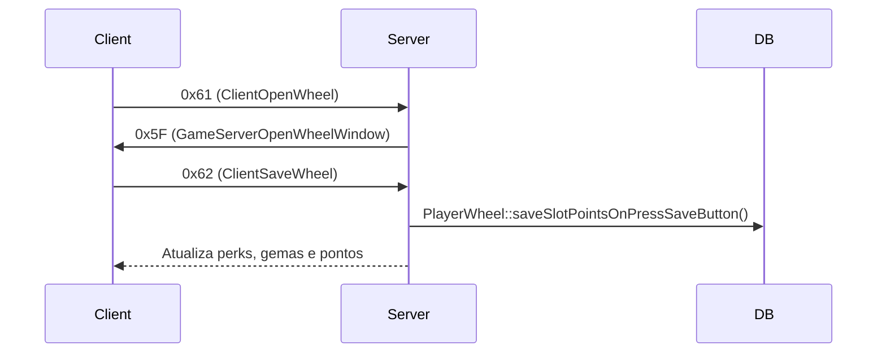

# 📘 Wheel of Destiny – Servidor (Canary)

Este documento descreve detalhadamente **a implementação da Wheel of Destiny no lado do servidor**, com base nos arquivos originais do Canary (`player_wheel.*`, `wheel_gems.*`, `protocolgame.*`).  
Serve como complemento direto ao arquivo `wheel_documentation.md` (cliente), espelhando toda a comunicação e lógica.

---

## 🔗 Comunicação Cliente ↔ Servidor

| Direção | Opcode | Constante | Função C++ | Função Lua | Descrição |
|----------|--------|------------|-------------|-------------|------------|
| Cliente → Servidor | `0x61` | `ClientOpenWheel` | `ProtocolGame::parseOpenWheel` | `g_game.openWheel(playerId)` | Solicita abrir a janela da Wheel |
| Cliente → Servidor | `0x62` | `ClientSaveWheel` | `ProtocolGame::parseSaveWheel` | `g_game.sendApplyWheelPoints(...)` | Envia pontos e gemas para salvar |
| Servidor → Cliente | `0x5F` | `GameServerOpenWheelWindow` | `PlayerWheel::sendOpenWheelWindow` | `WheelOfDestiny:onDestinyWheel(...)` | Envia todos os dados da Wheel ao cliente |

---

## 🧩 Estrutura Geral do Servidor

📁 **Diretório base:** `creatures/players/components/wheel/`

| Arquivo | Responsabilidade |
|----------|------------------|
| `player_wheel.hpp / .cpp` | Gerencia dados, pontuação, gemas e perks do jogador |
| `wheel_gems.hpp / .cpp` | Define estratégias e efeitos de gemas (resistência, bônus, etc.) |
| `wheel_spells.hpp` | Define estrutura de bônus em feitiços (heal, cooldown, leech) |
| `protocolgame.cpp / .hpp` | Manipula entrada e saída dos pacotes (parse/send) |

---

## 📨 1. Pacotes Recebidos do Cliente

### 1.1 `parseOpenWheel` (Opcode `0x61`)

📂 **Local:** `protocolgame.cpp`

```cpp
case 0x61:
    parseOpenWheel(msg);
    break;
```

📌 **Fluxo interno:**

1. O cliente envia `playerId` com o opcode `0x61`.
2. O protocolo lê o ID e chama `g_game().playerOpenWheel(player->getID())`.
3. O servidor responde com `PlayerWheel::sendOpenWheelWindow()` → **opcode 0x5F**.

💡 **Comunicação:**
```
Cliente → Servidor: 0x61 (ClientOpenWheel)
Servidor → Cliente: 0x5F (GameServerOpenWheelWindow)
```

---

### 1.2 `parseSaveWheel` (Opcode `0x62`)

📂 **Local:** `protocolgame.cpp`

```cpp
case 0x62:
    parseSaveWheel(msg);
    break;
```

📌 **Fluxo interno:**

1. Lê 36 `uint16_t` (pontos por slot).
2. Lê 4 blocos de dados de gemas (green, red, acqua, purple) → 1 byte (hasGem) + 2 bytes (id).
3. Encaminha para `Game::playerSaveWheel(player, msg)`.
4. Dentro do `Game`, chama `player->wheel().saveSlotPointsOnPressSaveButton(msg)`.
5. Essa função valida e grava os dados no KV/DB.

💡 **Comunicação:**
```
Cliente → Servidor: 0x62 (ClientSaveWheel)
Servidor → BD: gravações via PlayerWheel::saveSlotPointsOnPressSaveButton()
```

---

## 📤 2. Pacotes Enviados ao Cliente

### 2.1 `PlayerWheel::sendOpenWheelWindow` (Opcode `0x5F`)

📂 **Local:** `player_wheel.cpp`

```cpp
void PlayerWheel::sendOpenWheelWindow(NetworkMessage &msg, uint32_t ownerId)
```

📌 **Conteúdo do pacote enviado:**

| Campo | Tipo | Descrição |
|--------|------|------------|
| playerId | `uint32_t` | ID do jogador |
| canView | `uint8_t` | Permissão de visualizar a roda |
| changeState | `uint8_t` | Estado atual (mudança possível) |
| vocationId | `uint8_t` | Vocação do jogador |
| points | `uint16_t` | Pontos disponíveis |
| extraPoints | `uint16_t` | Pontos bônus (scrolls, achievements) |
| slotPoints[36] | `uint16_t[]` | Pontos investidos em cada slot |
| usedPromotionScrolls | `uint16_t[] + uint8_t extra` | Scrolls ativos e pontos extras |
| activeGems | `uint16_t[]` | Gemas equipadas |
| revealedGems | `struct GemData[]` | Gemas reveladas no Atelier |
| basicUpgrades | `map<uint8_t, uint8_t>` | Nível de aprimoramento básico |
| supremeUpgrades | `map<uint8_t, uint8_t>` | Nível de aprimoramento supremo |

💡 **Comunicação:**
```
Servidor → Cliente: 0x5F (GameServerOpenWheelWindow)
Cliente → Lua: WheelOfDestiny:onDestinyWheel(...)
```

---

## ⚙️ 3. Núcleo da Lógica (PlayerWheel)

📂 **Local:** `player_wheel.hpp / .cpp`

A classe `PlayerWheel` é o centro de toda a lógica. Ela coordena o carregamento, salvamento e cálculo de efeitos da roda.

### Funções principais:

| Função | Tipo | Descrição |
|--------|------|-----------|
| `init()` | void | Inicializa estruturas do jogador |
| `sendOpenWheelWindow()` | void | Monta o pacote `0x5F` |
| `saveSlotPointsOnPressSaveButton()` | void | Salva pontos e gemas (chamado no parse `0x62`) |
| `loadActiveGems()` / `saveActiveGems()` | void | Lê/escreve gemas do KV |
| `addPromotionScrolls()` | void | Adiciona scrolls ao pacote |
| `addGems()` | void | Adiciona gemas equipadas |
| `addGradeModifiers()` | void | Adiciona modificadores básicos/supremos |
| `getWheelPoints()` | uint16_t | Calcula total de pontos |
| `loadPlayerBonusData()` | void | Aplica bônus e perks |
| `printPlayerWheelMethodsBonusData()` | void | Mostra no log todos os bônus do jogador |

🗃️ **Armazenamento persistente:**
- **KV Store:** informações de gemas, grades, scrolls.  
- **Database (SQL):** pontos da roda (`slot_points`), persistidos em login/logout.

---

## 💎 4. Sistema de Gemas

📂 **Local:** `wheel_gems.hpp / .cpp`

O sistema de gemas utiliza o padrão **Strategy Pattern**, com múltiplas subclasses aplicando efeitos específicos.

### Principais classes:

| Classe | Efeito |
|--------|---------|
| `GemModifierResistanceStrategy` | Adiciona resistência elemental |
| `GemModifierStatStrategy` | Modifica HP, Mana, Capacidade, Mitigação |
| `GemModifierRevelationStrategy` | Aumenta afinidades de revelação |
| `GemModifierSpellBonusStrategy` | Concede bônus em feitiços (heal, dano, cooldown, leech) |

Essas estratégias são registradas via:

```cpp
WheelModifierContext::addStrategies(WheelGemBasicModifier_t modifier, uint8_t grade);
WheelModifierContext::addStrategies(WheelGemSupremeModifier_t modifier, uint8_t grade);
```

E aplicadas com:

```cpp
WheelModifierContext::executeStrategies();
```

---

## 🧠 5. Estruturas Importantes

| Nome | Tipo | Descrição |
|------|------|------------|
| `PlayerWheelGem` | struct | Representa uma gema (uuid, afinidade, qualidade, modificadores) |
| `PromotionScroll` | struct | Scrolls que concedem pontos extras |
| `PlayerWheelMethodsBonusData` | struct | Todos os bônus aplicados ao jogador (vida, mana, skills, leech, spells, perks) |
| `WheelSpells::Bonus` | struct | Estrutura usada pelos modificadores supremos |
| `WheelGemUtils` | classe | Retorna valores de stats conforme vocação e tipo de gema |

---

## 🔄 6. Ciclo Completo da Wheel



---

## 🧾 7. Logs Importantes

### PlayerWheel
- `[Wheel] Enviando pacote de ApplyWheelPoints...`
- `[Wheel] parseOpenWheelWindow -> playerId=...`
- `[Wheel] scrollCount=...`
- `[Wheel] pointInvested (36 slots)`
- `[Wheel] basicUpgraded count=...`

### Wheel Gems
- `[GemModifier] Executando estratégia: Resistance/Stat/Revelation/SpellBonus`
- `[WheelModifierContext] Estratégia aplicada com sucesso`

---

## ✅ Conclusão

Esta documentação cobre integralmente a camada **servidora da Wheel of Destiny**, mapeando:
- todos os opcodes (0x61, 0x62, 0x5F);
- funções correspondentes em `ProtocolGame`, `Game` e `PlayerWheel`;
- estratégias de gemas e estrutura de bônus.

Ela é **fiel aos arquivos originais do Canary**, e reflete exatamente o fluxo real de comunicação com o cliente OTClient 15.11 documentado em `wheel_documentation.md`.
